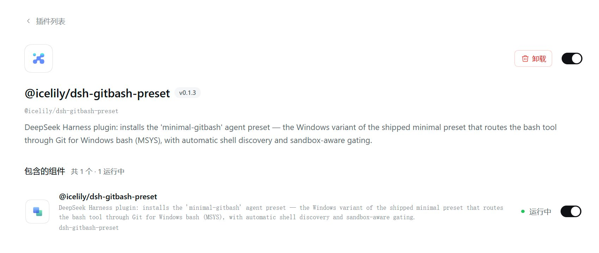

# dsh-gitbash-preset · 让 Windows 上的极简模式用上 Git Bash

> **English**: A DeepSeek Harness plugin that installs a "minimal (Git Bash)" agent preset, so on Windows the minimal mode's command tool runs Git for Windows bash instead of PowerShell.

[](LICENSE)


[](https://github.com/liceses/awesome-dsh-plugin)


DSH 的**极简模式**在 Windows 上不会给你 bash —— 官方按平台分叉，win32 那一支挂的是**持久 PowerShell**。
这个插件交付一个预设变体「**极简模式 (Git Bash)**」：persona 与 `str_replace_editor` 跟官方极简模式**逐字一致**，
只把命令工具换成 `bash`，每次调用真正跑在 **Git for Windows 的 bash（MSYS）** 上。

一句话：**Windows 上想要一个写 bash 的极简模式，装它。**

> [!IMPORTANT]
> **先看版本边界再动手。** 本插件用的是 DSH 早期的「用户预设目录」机制；在本次勘察所用的
> DSH `0.1.7-rc.2` 上，官方已把预设换成 bundle 声明行，**那个目录已不再被读取**。
> 详情与出处见 [已知限制 → DSH 版本边界](#limits-version)。旧版本上是否可用，**未在本机验证**。


*本机实拍：插件**装上了、组件「运行中」**，但这一页上**没有出现可选的预设卡片** —— 这正是上面那条版本边界的现场表现。*

---

<a id="toc"></a>
## 目录

| 想了解 | 看这里 |
| --- | --- |
| 装前 / 装后到底差在哪 | [它改变了什么](#diff) |
| 三分钟装起来 | [快速开始](#quickstart) |
| 装完之后你得到什么 | [装完之后你得到什么](#preset) |
| 它和姊妹插件 dsh-all-gitbash 的区别 | [与 dsh-all-gitbash 的关系](#sibling) |
| 命令到底怎么跑起来的 | [工作原理](#how) |
| 有哪些可配的字段 | [配置](#config) |
| 出问题 / 不适用 | [已知限制](#limits) |
| 想改代码 | [开发](#dev) |

---

<a id="diff"></a>
## 它改变了什么

DSH 自带的极简模式是**按平台分叉**的（源码出处：`@deepseek-ai/dsh-web-app` 的
`presets/minimal.patch.yml`，同一套分叉也在 `dsh-sdk-minimal/cordis.patch.yml` 里）：

```yaml
# 官方 minimal 预设的 persistent-shell 组（节选，逐字来自包内文件）
- id: terminal-bash      # 持久 bash
  name: '@deepseek-ai/dsh-terminal-bash'
  disabled: !!js process.platform === 'win32'      # ← Windows 上关掉
- id: persistent-bash
  name: '@deepseek-ai/dsh-tool-bash-persistent'
  disabled: !!js process.platform === 'win32'      # ← Windows 上关掉
- id: terminal-pwsh      # 于是 Windows 拿到的是持久 PowerShell
  name: '@deepseek-ai/dsh-terminal-bash'
  disabled: !!js process.platform !== 'win32'
  config: { shellDialect: pwsh }
- id: persistent-pwsh
  name: '@deepseek-ai/dsh-tool-pwsh-persistent'
  disabled: !!js process.platform !== 'win32'
```

也就是说：**Windows 上的极简模式没坏，只是命令工具是 PowerShell。** 本插件给的就是另一种选法。

| | 官方极简模式（POSIX） | 官方极简模式（Windows） | **本预设**（Windows） |
| --- | --- | --- | --- |
| 命令工具名 | `bash` | `pwsh` | `bash` |
| 命令落点 | `bash -c` | PowerShell | `<git bash> -c`（MSYS） |
| 会话状态 | 持久（`cd` / `export` 保留） | 持久（`$env:` 保留） | **每次调用新 shell**（不保留） |
| 路径写法 | `/home/...` | `C:\...`、`$env:NAME` | `/d/...`、`$NAME` |
| 文件工具 | `str_replace_editor` | `str_replace_editor` | `str_replace_editor`（同） |
| persona | 固定一句，`complete: true` | 同 | **逐字相同** |
| 后台命令 | 有 | 有 | **未启用**（`enableRunInBackground: false`） |

「每次调用新 shell」不是偷懒：Windows 上官方把持久 bash 整条支路关掉了（上面那两行 `disabled`），
而本插件的执行器是直接 `spawn` 一个 `bash -c`（见 [工作原理](#how)）—— 这是替代设计，不是等价实现。

---

<a id="quickstart"></a>
## 快速开始

**前置条件**：Windows；装了 **Git for Windows**；DSH 的 Node ≥ 20。

```bash
dsh plugin --profile web add @icelily/dsh-gitbash-preset
```

装完 **重启 DSH**（插件行在启动时装配，重启时才会把预设文件写进用户预设根）。

> **注意包名**：安装命令必须用**包名** `@icelily/dsh-gitbash-preset`，
> 不能写仓库名 `dsh-gitbash-preset` —— 后者在 npm 上不是这个包，会装失败。

然后：**新建会话 → 选「极简模式 (Git Bash)」→ 把会话沙箱切到「完全访问」**，
之后所有 `bash` 调用直接走 Git Bash。想留在 workspace-write 也可以，让模型在第一次调用失败后
按提示用 `sandbox_permissions: "danger-full-access"` + justification 单次升级（走正常审批流程）。

> ⚠️ **先读 [已知限制](#limits)。** 本插件依赖的用户预设目录在当前 DSH 上已不再被读取，
> 装完**可能选不到这个预设**（[出处与核对方式](#limits-version)）。

---

<a id="preset"></a>
## 装完之后你得到什么

预设文件被复制到 `${DSH_HOME:-~/.dsh}/.agent-presets/minimal-gitbash/`（`lib/index.js:32-37`），
一共三个文件加一份测试。下面是**仓库里真实的内容**（不是示意）。

[`agent-presets/minimal-gitbash/preset.yml`](agent-presets/minimal-gitbash/preset.yml) —— 预设的显示信息：

```yaml
name: 极简模式 (Git Bash)
description: 极简模式的 Windows 变体：bash 调用映射到 Git for Windows 的 bash（MSYS），需在"完全访问"沙箱模式或经 sandbox_permissions 单次升级后使用。
order: 6
```

> `order: 6` 排在官方四个预设之后（`standard` 标准模式=1 / `ptc` PTC 模式=2 /
> `minimal` 极简模式=3 / `cordis` 创造模式=4；顺序取自 `@deepseek-ai/dsh-web-app` 的 `presets/*.patch.yml`）。

[`agent-presets/minimal-gitbash/agent.cordis.yml`](agent-presets/minimal-gitbash/agent.cordis.yml) —— 预设挂的三个组：

```yaml
- id: persona                       # ① 与官方 minimal 逐字相同的一句话 persona
  name: '@deepseek-ai/dsh-persona'
  config:
    prefix: You are a helpful software engineer assistant.
    complete: true                  # 这段话就是完整系统提示，后面的装配监听器加不进字
    includeRuntimeContext: false    # 也不注入运行时上下文快照

- id: gitbash-shell                 # ② 会话内的 shell 服务 + bash 工具
  name: cordis:group
  group: true
  disabled: !!js process.platform !== 'win32'   # ← 非 Windows 直接禁用
  isolate: { shell: true }          # entry-local realm：只在本预设内顶替 shell 服务
  config:
    - id: gitbash-executor
      name: ./gitbash-executor.mjs  # 相对名：从预设目录加载（见「已知限制」）
      config: { timeoutMs: 120000, maxTimeoutMs: 600000, maxOutputBytes: 64000, maxSpillBytes: 67108864, graceMs: 3000 }
    - id: tool-bash
      name: '@deepseek-ai/dsh-tool-bash'
      config: { enableRunInBackground: false }

- id: filesystem                    # ③ 文件工具（与官方极简模式一致）
  name: cordis:group
  group: true
  isolate: { fs: true }
  config:
    - id: fs-local
      name: '@deepseek-ai/dsh-fs-local'
      config: { cwd: !!js process.env.DSH_CWD ?? process.cwd() }
    - id: str-replace-editor
      name: '@deepseek-ai/dsh-tool-str-replace-editor'
      config: { maxOutputChars: 16000 }
```

**模型看到的能力面因此只有两个工具**：`bash` 与 `str_replace_editor`；没有 pwsh 工具，
没有上下文压缩（跟官方极简模式的取舍一致）。

---

<a id="sibling"></a>
## 与 dsh-all-gitbash 的关系

同一个作者的姊妹插件 [**dsh-all-gitbash**](https://github.com/liceses/dsh-all-gitbash)
也把 Windows 上的命令引到 Git Bash，但**改的是完全不同的东西**：

| | **dsh-gitbash-preset**（本仓库） | [dsh-all-gitbash](https://github.com/liceses/dsh-all-gitbash) |
| --- | --- | --- |
| 一句话 | 给**极简模式**一个 bash 版预设 | 把**完整模式**（web）的 pwsh 执行器整个改道 bash |
| 作用对象 | `minimal` 预设里的命令工具 | 宿主已挂载的 `ctx.shell`（`dsh-pwsh-sandbox` 实例） |
| 生效范围 | **只影响选了本预设的会话** | **所有会话**（宿主全局） |
| 实现手段 | 交付一份 agent preset，`isolate: {shell:true}` 在会话 realm 内自供 `shell` | 运行时把执行器实例的 `argv()` 换成 `[<git bash>, '-c', 命令]`（原型方法遮蔽），并注册 `bash` 工具、移除 `pwsh` 工具、注入 PATH 垫片 |
| 工具面 | `bash` + `str_replace_editor` | 保留完整模式的全部工具，只是 `pwsh` 换成 `bash` |
| 开关 | 无（预设常驻，切换预设即切换） | 有：设置面板滑块 / `settings.yaml` 的 `enabled`，往返无损 |
| 安装 | `dsh plugin --profile web add @icelily/dsh-gitbash-preset` | `dsh plugin --profile web add @icelily/dsh-all-gitbash` |
| 包名 | `@icelily/dsh-gitbash-preset` | `@icelily/dsh-all-gitbash` |

**怎么选**：

- 只想在**极简模式**里写 bash、其他会话不动 → 装本插件；
- 想在**完整模式**下也全程 bash、还要一键开关 → 装 dsh-all-gitbash；
- 两个都装也可以：极简会话走本预设的 bash，其他会话走姊妹插件的 bash。
  两边都是 Git Bash，命令落点一致。

两者共用同一条沙箱边界：**MSYS 在 Windows 受限令牌沙箱里起不来**（无法创建 signal pipe），
所以两边都门控到 `danger-full-access` 并给升级指引 —— 都不绕过沙箱。

---

<a id="how"></a>
## 工作原理

一句话：**用一个会话内的 `shell` 服务顶替官方执行器，把每条命令变成 `"<git bash>" -c <命令>`。**

```
模型 ──bash 工具──► ctx.shell（本预设提供的 gitbash-executor）
                          │
                          ├─ 沙箱门控：mode !== 'danger-full-access' → 抛错 + 升级指引
                          │
                          └─ subprocess.spawn([ <git bash>, '-c', <命令> ])  ──► Git Bash (MSYS)
```

四个环节：

| 环节 | 说明 | 出处 |
| --- | --- | --- |
| 装配点 | `cordis.patch.yml` 往 web profile 的插件名单里 `insert` 一行 `dsh-gitbash-preset`；启动时它只做一件事：把包内预设复制到用户预设根 | `cordis.patch.yml:11-13`、`lib/index.js:49-73` |
| 幂等安装 | 三个文件都在且没配 `force` → 只打一行日志返回；还会**逐字节**比对包内与已装文件，不一致时提示 `set force: true` | `lib/index.js:52-63` |
| 服务顶替 | 预设的 `gitbash-shell` 组 `isolate: { shell: true }`，在 entry-local realm 内 `ctx.provide('shell', executor)` —— 只在本预设内生效，不碰宿主的执行器 | `agent.cordis.yml:31-47`、`gitbash-executor.mjs:346` |
| 命令执行 | 每次调用 `subprocess.spawn([shellPath, '-c', command])`；固定注入 `NO_COLOR=1` / `TERM=dumb` / `PAGER=cat` / `GIT_PAGER=cat`，避免交互式分页器把输出卡住 | `gitbash-executor.mjs:38-43`、`:213-224` |

### Git Bash 怎么找到的

`detectShellPath()` 按顺序取第一个**存在**的候选（`gitbash-executor.mjs:83-117`）：

1. 配置里的 `shellPath`（显式指定，优先级最高）；
2. 环境变量 `GIT_BASH`；
3. `%ProgramFiles%\Git\bin\bash.exe`；
4. `%ProgramFiles(x86)%\Git\bin\bash.exe`；
5. `%LOCALAPPDATA%\Programs\Git\bin\bash.exe`；
6. 一个写死的兜底路径 `D:\applications\Git\bin\bash.exe`（作者本机遗留，对别人通常是无效候选，无害）；
7. PATH 逐目录找 `bash.exe`，**跳过 `System32` / `Sysnative` / `SysWOW64`** —— 那里是 Microsoft 的 WSL 启动器存根，
   用它当 shell 会在没装发行版时报「没有已安装的分发版」。这是 issue [#1](https://github.com/liceses/dsh-gitbash-preset/issues/1) 的修复；
8. 都不存在 → 返回裸名 `bash`，让 spawn 自己报出解析错误。

### 路径翻译的边界

`toWindowsPath()` 只做一件事：把 MSYS 的单字母盘符路径转成 Windows 路径（`gitbash-executor.mjs:54-64`）。
边界由单元测试逐条钉住（`test/gitbash-executor.test.mjs:23-45`）：

| 输入 | 输出 | 为什么 |
| --- | --- | --- |
| `/d/foo`、`/d/foo/bar.txt` | `D:\foo`、`D:\foo\bar.txt` | 盘符形，转 |
| `/d`、`/d/` | `D:\` | 同上 |
| `/usr/bin`、`/tmp/x` | **原样不动** | 只认「单字母 + `/` 或结尾」，否则 `/usr/bin` 会被拧成 `U:\sr\bin` |
| `D:\foo`、`D:/foo`、`\\server\share\x` | 原样通过 | 已经是 Windows / UNC 形态 |
| `foo/bar`、`''`、`undefined` | 原样通过 | 相对路径与空值不动 |

非 Windows 平台这个函数直接返回原值（`gitbash-executor.mjs:55`），整个 `gitbash-shell` 组也被
`process.platform !== 'win32'` 禁用 —— 所以这是**一个 Windows 专用插件**，不要指望它在 macOS / Linux 上做任何事。

---

<a id="config"></a>
## 配置

**预设配置**（`agent-presets/minimal-gitbash/agent.cordis.yml` 的 `gitbash-executor`）：

| 字段 | 默认 | 说明 |
| --- | --- | --- |
| `shellPath` | 自动探测 | 显式指定 Git Bash 路径时优先，可写 Windows 或 MSYS 形（如 `'C:\\Program Files\\Git\\bin\\bash.exe'`） |
| `cwd` | 不设 | 显式工作目录；不设时用请求的 workdir，再退回 `process.cwd()` |
| `timeoutMs` | `120000` | 单次命令默认超时 |
| `maxTimeoutMs` | `600000` | 单次请求超时的上限（`resolve` 里 `Math.min` 钳位） |
| `maxOutputBytes` | `64000` | 单流保留字节数，溢出写入 spill 文件 |
| `maxSpillBytes` | `67108864`（64 MB） | spill 文件上限 |
| `graceMs` | `3000` | 终止进程的 SIGTERM→SIGKILL 宽限 |

数值字段必须是**正的有限数**，且三个时间字段不得大于 Node 的定时器上限 `2147483647`；
违反会在装配时抛 `TypeError`（`gitbash-executor.mjs:119-134`，测试 `:128-137`）。

**插件配置**（`cordis.patch.yml` 插入的那一行）：

| 字段 | 默认 | 说明 |
| --- | --- | --- |
| `force` | `false` | 预设已存在时，是否用包内文件覆盖（用户额外放进去的文件会保留） |

`force: true` 的典型用途见 [已知限制 → 升级路径](#limits-upgrade)。

---

<a id="tree"></a>
## 目录结构

```
dsh-gitbash-preset/
├── package.json                                    # 无任何依赖；dsh.bundle.patch 指向 cordis.patch.yml
├── cordis.patch.yml                                # 装配点：insert 一行 dsh-gitbash-preset
├── LICENSE                                         # MIT
├── lib/
│   └── index.js                                    # 宿主半边（74 行）：启动时把预设复制进用户预设根
└── agent-presets/minimal-gitbash/                  # 会被整体复制到用户预设根
    ├── preset.yml                                  # 显示名 / 描述 / order
    ├── agent.cordis.yml                            # 预设的插件清单（persona + gitbash-shell + filesystem）
    ├── gitbash-executor.mjs                        # 会话内 shell 服务提供者（347 行）
    └── test/gitbash-executor.test.mjs              # 10 个用例（纯函数）
```

---

<a id="limits"></a>
## 已知限制

<a id="limits-version"></a>
### DSH 版本边界（**最重要的一条**）

本插件的安装机制是「把预设文件写进 `${DSH_HOME:-~/.dsh}/.agent-presets/<id>/`」。
这个目录**在较新的 DSH 上已经没人读了** —— 官方把用户预设换成了 bundle 声明行。原文出处
（本机安装的 `@deepseek-ai/dsh-agent-preset@0.1.7-rc.2`）：

- `skills/editing-cordis-compositions/SKILL.md`：
  > Before declaration rows, a user preset was a directory `$DSH_HOME/.agent-presets/<id>/` holding
  > `preset.yml` … and `agent.cordis.yml` … **Nothing reads that directory any more.**
- 同包 `README.md`：
  > Declarations provide **no directory, file-copy or file-delete operations**.
- 同技能还有一条对本地相对插件名不利的要求：
  > **Resolve assets from installed packages rather than a preset directory.**

**可以自己核对的旁证**：在本机 `…\@deepseek-ai\dsh\node_modules\@deepseek-ai` 目录下搜
`.agent-presets`、`agent.cordis.yml`、`preset.yml`，**命中的只有上面这段技能文本**，
没有任何 loader 代码读它；现在的预设是 `dsh-web-app/presets/<id>.patch.yml` 里的声明行（roster 行 id `preset-<id>`）。

**结论**：在 DSH `0.1.7-rc.2` 上，安装器**会正常执行**（文件确实写到位了），
但**不会出现可选的预设卡片**。旧版本上是否可用，**本机未验证**。
如果你正是遇到「装完在设置里找不到极简模式 (Git Bash)」，原因就在这里。

迁移方向（**尚未实施**）：把预设改写成 bundle 声明行，并让 `gitbash-executor.mjs` 从**已安装的包**里解析，
而不是当预设目录里的相对文件。这件事需要动源码，本次只改 README，未处理。

<a id="limits-upgrade"></a>
### 升级路径（对能用的版本）

安装器对已存在的预设默认 **no-op**。`0.1.3` 之前的版本装出的预设是坏的（用了 `dsh-persona` 旧的
`text` 字段，装配会报 `$.prefix missing required value`）。升级插件后要**显式**让它覆盖：

- 在插件行配置 `force: true`，或
- 删掉 `~/.dsh/.agent-presets/minimal-gitbash/` 再重启。

（`0.1.3` 起改用 `prefix`；本机核对 `@deepseek-ai/dsh-persona@0.1.7-rc.2` 的 schema 确实是
`prefix` 必填、`complete` 默认 `false`、`includeRuntimeContext` 默认 `true`，与预设写法一致。）

### 其它

- **只对极简模式生效**。它交付的是一个 agent preset，只有**选了「极简模式 (Git Bash)」的会话**受影响。
  完整模式（web）下的 pwsh 工具、其他预设的命令工具，一律不动 —— 那正是
  [dsh-all-gitbash](https://github.com/liceses/dsh-all-gitbash) 要解决的事。
- **需要 Git for Windows**。没装的话探测链全部落空，最终返回裸名 `bash`，每条命令都会 spawn 失败。
  装了但不在标准目录时，用 `GIT_BASH` 环境变量或 `shellPath` 配置指路。
- **受限沙箱下用不了**。MSYS 运行时无法在 Windows 受限令牌沙箱内初始化（创建不了 signal pipe），
  所以执行器只在 `danger-full-access`（或部署本身没有沙箱策略）下放行，其余情况抛错并给升级指引。
  **这是沙箱边界，插件不绕过。**
- **bash 不保持状态**。每次调用都是新 shell，`cd` / `export` 不会留到下一次；后台命令也没启用
  （`enableRunInBackground: false`）。这是「Windows 上官方持久 bash 支路被关掉」的替代设计，不是等价实现。
- **路径有两个域**。文件工具走 Node（Windows 路径 `D:\...`），bash 走 MSYS（POSIX 路径 `/d/...`）。
  两者都能接受 `D:/...` 这种正斜杠形式 —— 拿不准时用这个写法。`toWindowsPath` 只转单字母盘符形，
  `/usr/bin` 这类 MSYS 根路径不会被误转。
- **探测链里有一条作者本机遗留的写死路径** `D:\applications\Git\bin\bash.exe`
  （`gitbash-executor.mjs:89`）。对别的机器通常只是无效候选，无害；但它是本机痕迹，未擅自改动源码。
- **无卸载命令记录**。仓库里只有安装命令，没有对应的移除命令，所以这里也不写。

---

<a id="dev"></a>
## 开发

零依赖、零构建：`lib/index.js` 与 `agent-presets/` 都是入库的手写文件，改完直接跑。

```bash
npm run check   # 三个文件的语法检查（插件 / 执行器 / 测试）
npm run test    # 单元测试：10 个用例（路径转换 / 探测优先级 / WSL 启动器防御 / 配置校验）
```

测试只覆盖**纯函数**（`toWindowsPath` / `detectShellPath` / `isWslBashDirectory` / `resolveConfig`），
不碰 `ctx`、不真的 spawn —— 真实的 spawn 路径要在活的 DSH 会话里验证（测试文件头注释原话）。

**改预设要注意**：预设是「复制到用户预设根」的一次性动作，改了包内文件后，已经装过的机器
**不会自动更新**（默认 no-op）。本地迭代要么配 `force: true`，要么先删掉已装目录。

> 想在本地边改边试，也可以不装插件，直接把 `agent-presets/minimal-gitbash/` 复制到
> `~/.dsh/.agent-presets/` —— 但这条捷径同样受 [DSH 版本边界](#limits-version) 影响。

---

<a id="license"></a>
## 许可

MIT —— 见仓库根目录的 [`LICENSE`](LICENSE)（`Copyright (c) 2025 icelily`），
与 [`package.json`](package.json) 的 `license` 字段一致。

---

## 相关

- [dsh-all-gitbash](https://github.com/liceses/dsh-all-gitbash) —— 姊妹插件：把**完整模式**下所有 pwsh 命令改道 Git Bash（带一键开关）。
- [awesome-dsh-plugin](https://github.com/liceses/awesome-dsh-plugin) —— DSH 插件精选列表。
